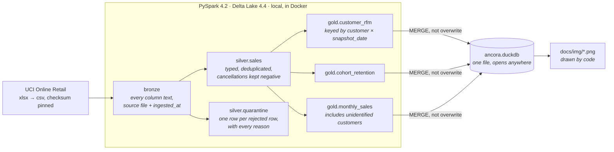
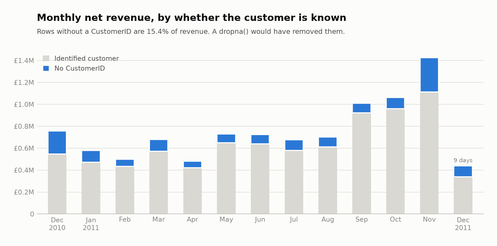
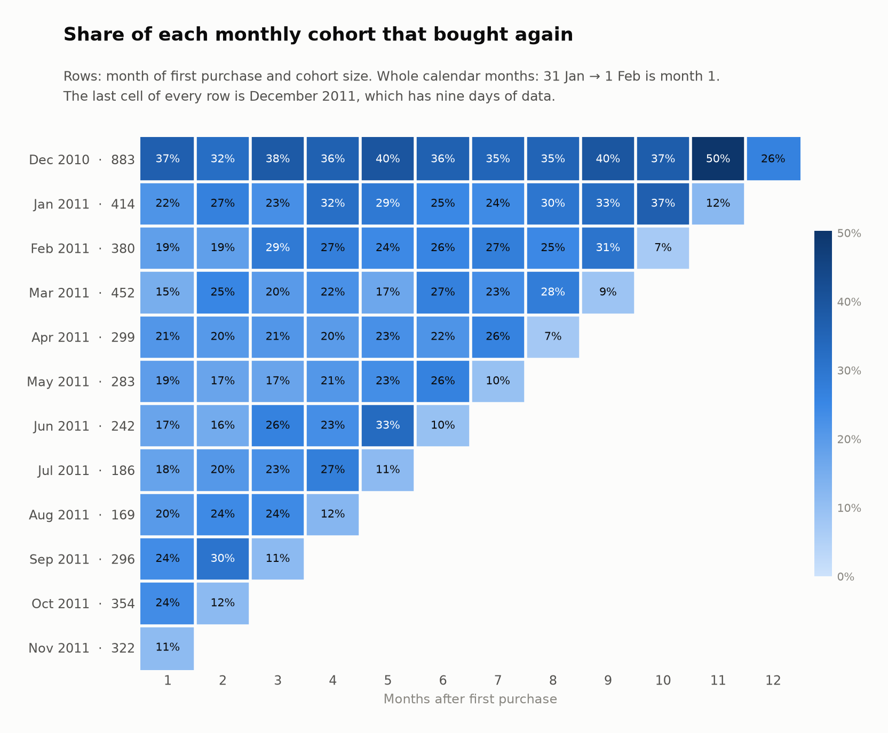
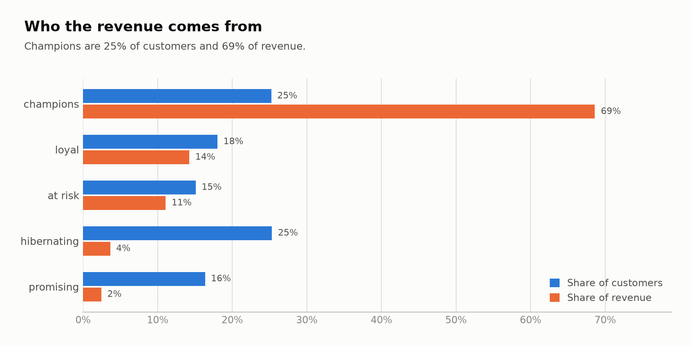

# Âncora

### The same input always produces the same segments.

RFM and cohort segmentation of the UCI *Online Retail* dataset, rebuilt as a
bronze / silver / gold lakehouse: PySpark and Delta Lake for the
transformations, DuckDB for serving, one Docker image for all of it.

<p>
  <a href="https://github.com/kabianca/cohort-rfm-ecommerce/actions/workflows/tests.yml">
    
  </a>
  
  
  
  
  
</p>

**English** · [Português](README.pt-BR.md)

## Why I rebuilt this

This repository started as the third project of a data-analysis
certification: one Jupyter notebook, a Kaggle CSV, a Google Data Studio
dashboard. That notebook is still here, untouched, in [`legacy/`](legacy/),
because the distance between it and the code around it is the point of the
repository.

The notebook computes recency like almost every RFM notebook does:

```python
hoje = datetime.now()
rfm['Recencia'] = (hoje - rfm['UltimaCompra']).dt.days
```

The dataset ends on 9 December 2011. Run that line today and every customer's
recency is more than five thousand days; run it tomorrow and every number is
different again. Whether the segments move depends on how the bins are cut,
and nobody finds out, because nobody runs a notebook twice.

So the thesis here is the opposite of "look at the segments": it is that
**two runs over the same input produce the same segments, on any day, on any
machine**, and that every decision which could break that is written down and
tested. Recency is anchored to an explicit `snapshot_date`. Ties in a quintile
cut are resolved by a rule, not by row order. Sums are decimals, not doubles.
Rows the model cannot use are quarantined with a reason, never dropped.

The companion repository, [Maré](https://github.com/kabianca/bcb-airflow-pipeline),
argues *correct under replay* for ingestion with Airflow. This one argues
*deterministic under re-run* for transformation, and deliberately has no
orchestrator: a portfolio is judged on coverage, not repetition.

---

## Architecture



Bronze is replaced per source file, silver is rebuilt from bronze, gold is
merged. A second run changes nothing, and the Delta history says so.

---

## Design decisions

This is the section I would want to read first as a reviewer.

### Recency is measured from `snapshot_date`, never from the clock

`customer_rfm` takes one parameter. It defaults to the last invoice date in
the data (`2011-12-09`), and it can be set to any day: only invoices on or
before it are considered, so `--snapshot-date 2011-06-30` produces the
segmentation as it would have been on 30 June 2011, not a reweighting of
today's. Different snapshots coexist in the table, keyed by
`(customer_id, snapshot_date)`.

No call to `now()`, `today()` or `current_date()` exists in the
transformations. The one wall-clock value in the project is bronze's
`_ingested_at`, which is lineage, and nothing downstream reads it. A test moves
the snapshot by seven days and asserts that every recency moves by exactly
seven and nothing else changes.

### Ties get the same score, whatever order the rows came in

Scores are quintiles of `percent_rank()`, which assigns tied values the same
rank. In a wholesale dataset the ties are enormous: **1,493 of the 4,320
customers bought exactly once**. `pd.qcut` on that column refuses outright
(the 20 % and 40 % edges are both 1), and the usual workaround,
`rank(method="first")` (or `ntile()` in Spark), splits the tie by whatever
order the rows happen to be in, so some once-only buyers become score 2
because of where their row sat in a file. Here they are all score 1, and
customers with four, five or six invoices all share score 4.

The cost is real and worth naming: the quintiles are not 20 % each. Frequency
lands at 35 / 19 / 12 / 19 / 16 %. I take that over a segmentation of real
customers that depends on sort order.

Segments are then an ordered rule list over the recency score and the average
of frequency and monetary, first match wins, last rule catches everything. A
test feeds all 125 score combinations through it and checks each gets exactly
one segment.

### Absence and cancellation are not errors

The dataset has three things a `dropna()` treats as one:

- **135,080 rows (25 %) have no `CustomerID`.** They cannot be segmented, but
  they are sales. They are excluded from RFM and **kept in monthly revenue**,
  where they are 15.4 % of the year, £1.5 M of £9.8 M. The notebook's
  `dropna()` removed them from every month.
- **8,668 cancellation rows** (`InvoiceNo` starting with `C`, negative
  quantity) worth −£475,901. The notebook removed them; here they stay in
  silver with their sign, and the gold layer nets them: a cancellation lowers
  the right customer's monetary value and shows up as negative revenue in the
  month it happened, instead of vanishing.
- **10,670 rows the model cannot use** go to `silver.quarantine`, each with the
  list of reasons it failed, 1,363 rows fail two rules at once. Bad data is
  treated as data, with a trail:

  | Reason | Rows |
  |---|---:|
  | `duplicate`: byte-for-byte copy of another row | 5,268 |
  | `non_product_stock_code`: postage, `Manual`, `AMAZONFEE`, discounts, bank charges | 2,912 |
  | `zero_unit_price` | 2,515 |
  | `negative_quantity_outside_cancellation`: stock adjustments, all without a customer | 1,336 |
  | `negative_unit_price`: two "Adjust bad debt" rows | 2 |

  Excluding the service codes moves annual revenue by under half a percent
  net, but the gross parts are large and would silently offset each other
  inside "revenue": postage is £272 k, Amazon fees are −£222 k. Both are
  recoverable from the quarantine table.

Who counts as a customer follows from the same principle. A customer belongs
to the gold layer when their net spend is positive. Someone who bought £49.50
in January and returned all of it in February did not become a customer and
does not found the January cohort; someone whose only row is a refund of a
purchase made before the data starts is not one either. That excludes 42
identified customers (net −£4,160), whose amounts still count in
`monthly_sales`, because revenue is revenue whoever it came from.

### Bronze reads text

Every column lands as a string, plus the source file name. Letting Spark infer
types is already a modelling decision (`"ten"` becomes null, 30 February
becomes null) taken silently; here silver takes it with `try_cast` and
`try_to_timestamp`, and a row that will not type gets a quarantine reason. The
real file has no such row. The fixture has two, on purpose.

Re-landing the same file replaces its rows (`replaceWhere` on the file name),
so bronze never holds two copies of one source.

### Decimal, not double

`unit_price` is `DECIMAL(10,3)`, `line_amount` is `DECIMAL(14,3)`. A sum of
doubles depends on the order the partitions arrive in, which is exactly the
kind of thing that makes two runs differ in the last digit and a fingerprint
comparison fail for no reason anyone can defend. The session time zone is
pinned to UTC for the same reason: the CSV carries naive timestamps, and a
23:55 invoice must not change day between the laptop that built the tables
and the CI that reads them.

### Gold is merged, not rebuilt

Each gold table is updated with a Delta `MERGE`: matched rows are updated,
new rows inserted, and rows the source no longer produces are deleted for
`customer_rfm`, only within the snapshot being written, so other snapshots
are untouched. A re-run converges to exactly what the source says instead of
accumulating leftovers, and the table's history shows it: the second run of
the full dataset is one `MERGE` with 4,320 rows updated, 0 inserted, 0
deleted.

### One image, three versions pinned together

Spark, Delta and Java break when they drift apart, and each lives somewhere
different (a pip pin, a Maven artefact, an apt package). Here `pyproject.toml`
pins `pyspark==4.2.0` and `delta-spark==4.4.0`, the `Dockerfile` pins Java 21,
and a comment next to each says what was verified and when: Delta 4.4.0 is
built and tested against Spark 4.2.0, and requires Java 17 or newer. The Delta
jars and DuckDB's `delta` extension are fetched at image build time, so
`make test` and `make run` need no network, and the first test in the suite
writes a Delta table, merges into it and reads it back from DuckDB, the test
that fails first if one of the three is bumped alone.

### DuckDB serves, Spark transforms

The gold tables are materialised into a single `data/serving/ancora.duckdb`.
It opens in any SQL client on any machine without Spark, Java or the lake, and
it is what the figures are drawn from. Spark on a laptop is the right tool for
the transformations and the wrong one for looking at 4,320 rows.

---

## Running it

Requires Docker; the image is about 2.3 GB with Spark and a JVM inside.

```bash
make build    # Spark + Delta + DuckDB, jars pre-fetched
make data     # downloads the UCI archive (23 MB), verifies its checksum, converts to CSV
make run      # bronze → silver → gold → DuckDB, about a minute on a laptop
make charts   # redraws docs/img/*.png from the serving database
make test     # 39 tests against the committed fixture, no dataset or network needed
```

`make run SNAPSHOT=2011-06-30` segments the customers as of that day.

### Proving it in ten seconds

Run it twice and compare a hash of the whole `customer_rfm` table. That is the
thesis of the repository, and the one claim you can falsify yourself.

```bash
$ make run && make fingerprint
4320 customers  e6f4fb920bda77382092e14b1215316f
$ make run && make fingerprint
4320 customers  e6f4fb920bda77382092e14b1215316f
```

### Looking at the results

```bash
make shell
python -c "import duckdb; con = duckdb.connect('data/serving/ancora.duckdb'); \
  print(con.sql('select segment, count(*) customers, sum(monetary) revenue from customer_rfm group by 1 order by 3 desc'))"
```

```text
┌─────────────┬───────────┬───────────────┐
│   segment   │ customers │    revenue    │
│   varchar   │   int64   │ decimal(38,3) │
├─────────────┼───────────┼───────────────┤
│ champions   │      1090 │   5674120.250 │
│ loyal       │       778 │   1177445.631 │
│ at_risk     │       652 │    915155.871 │
│ hibernating │      1094 │    300480.961 │
│ promising   │       706 │    202434.610 │
└─────────────┴───────────┴───────────────┘
```

A quarter of the customers bring 69 % of the revenue. The other quarter, the
hibernating ones, bring 4 %.

---

## Figures

Drawn by `make charts` from the serving database, so they change when the
data does and not otherwise.





The December 2010 cohort is the largest and the stickiest, 37 % came back
the next month, and 50 % bought in November 2011. It is also the only cohort
that includes customers who were already buying before the data starts, which
is the honest reason it looks so good.



---

## Layout

```text
cohort-rfm-ecommerce/
├── ancora/
│   ├── session.py               # one SparkSession: Delta, UTC, loopback, pre-fetched jars
│   ├── config.py                # the lakehouse layout as a value, so tests can relocate it
│   ├── download.py              # make data: UCI zip → xlsx → csv, checksum pinned
│   ├── bronze.py                # text in, text out, plus lineage; replaceWhere per file
│   ├── silver.py                # typing, deduplication, ten quarantine rules
│   ├── rfm.py                   # quintiles that respect ties; the segment rule list
│   ├── gold.py                  # customer_rfm(snapshot_date), cohort_retention, monthly_sales; MERGE
│   ├── serving.py               # DuckDB file, fingerprint, the three figures
│   └── __main__.py              # python -m ancora run | charts | fingerprint
├── tests/
│   ├── fixtures/                # 41 rows and a README explaining each customer's role
│   ├── test_bronze.py · test_silver.py · test_gold_rfm.py · test_gold_cohort.py
│   ├── test_gold_monthly_sales.py · test_rfm_rules.py · test_serving.py · test_stack.py
├── legacy/                      # the original notebook, as submitted
├── docs/img/                    # figures, generated
├── Dockerfile · docker-compose.yaml · Makefile · pyproject.toml
└── .github/workflows/tests.yml  # builds the image, lints, runs the suite inside it
```

---

## Tests

Every line of the design above is a test, and the suite runs against a
41-row fixture that carries every trap the real file has, a cancellation, a
null customer, an exact duplicate, a zero and a negative price, service stock
codes, three customers tied on frequency, a purchase at 23:55 on 31 January.
[`tests/fixtures/README.md`](tests/fixtures/README.md) says what each row is
for.

```text
test_gold_rfm.py            recency anchored to the snapshot; ties share a score; a cancellation
                            lowers the right customer; a duplicate does not inflate frequency;
                            revenue by segment reconciles; MERGE converges and keeps other snapshots
test_gold_cohort.py         31 Jan → 1 Feb is month 1; a fully cancelled customer founds no cohort
test_gold_monthly_sales.py  unidentified customers count; a cancellation is negative, not lost
test_silver.py              every bronze row lands in exactly one table, with every reason
test_bronze.py              nothing coerced; re-landing a file does not duplicate it
test_rfm_rules.py           125 score combinations, one segment each; order-independent scores
test_serving.py             DuckDB counts, repeatable refresh, stable fingerprint, figures drawn
test_stack.py               Delta write, MERGE and DuckDB read, with the pinned versions
```

The suite runs inside the image (`make test`), because Spark needs Java and
the point of the image is that nobody has to install it. CI builds the same
image on every push and pull request and runs lint and the suite in it; there
is no path where a test skips itself because a dependency is missing. Spark
start-up is most of the 100 seconds.

---

## What running it taught me

- **Spark 4 is ANSI by default.** `cast('ten' as int)` raises instead of
  returning null. Silver uses `try_cast` and `try_to_timestamp` deliberately,
  because null is what the quarantine rules look for.
- **Column names are case-insensitive.** `Quantity` (raw) and `quantity`
  (typed) cannot be siblings in one DataFrame. The raw columns travel through
  silver inside a `raw` struct and are unpacked into the quarantine table.
- **A `Column` needs a live session.** A module-level `F.col(...)` fails at
  import time; predicates are built on demand.
- **A window partitioned by a constant is a single partition** Spark warns
  about it every run. The RFM scores rank every customer of a snapshot, so
  that is the design, and the warning is silenced with a comment saying why.
- **Delta 4.1+ names its Maven artefact by Spark minor version**
  (`delta-spark_4.2_2.13`), and `configure_spark_with_delta_pip` picks the
  suffix from the installed pyspark. The pip metadata allows Spark 4.0–4.2;
  the release notes say which of those each Delta version was built and tested
  against. Trust the second.
- **A container without a network cannot resolve its own hostname**, and
  Spark's first act is to look it up. Binding the driver to loopback fixed
  both `--network none` and the laptop-with-odd-DNS case in one line.
- **`openpyxl` returns `InvoiceNo` as int for 532,618 rows and str for
  9,291.** The conversion to CSV turns everything into its text form and lets
  silver decide what it is.
- **December 2011 is nine days.** The last bar of the revenue chart and the
  last cell of every cohort row look like a collapse until you know that.

---

## Where this grows

The repository is complete as it stands. These are the seams, in the order I
would build them:

| Next | What it adds | Where it plugs in |
|---|---|---|
| **A snapshot series** | Run monthly snapshots and derive a segment migration matrix: who moved from `loyal` to `at_risk` between June and July | `customer_rfm` is already keyed by snapshot; a loop over `--snapshot-date` and one gold table |
| **Incremental silver** | Silver is rebuilt from bronze on every run; a `MERGE` keyed on `(source file, row)` would make it incremental too | `silver.build` |
| **Orchestration** | Scheduling and backfill | Maré already shows the pattern; a DAG calling `pipeline.run` per snapshot |
| **Country in the gold layer** | The notebook split the UK from the rest; the data is there | A `country` dimension on `cohort_retention` and `monthly_sales` |
| **Declarative expectations** | Great Expectations or Soda over silver | The quarantine rules become expectations; the table boundary stays |

## What I would do differently in production

- **Object storage, not a bind mount.** `config.Layout` is one value; the
  paths would point at S3 or ADLS and nothing else changes.
- **A catalog.** Tables are addressed by path. Unity Catalog or Glue would give
  them names, permissions and lineage.
- **Snapshot as a scheduled parameter, not a CLI flag.** The orchestrator's
  data interval becomes `snapshot_date`, which is the same idea as Maré's
  "every boundary comes from the interval, never from `now()`".
- **Alerting on the quarantine.** Its size is a signal today only if someone
  looks. A threshold per reason would make it an incident.

---

## Data

Source: [Online Retail](https://archive.ics.uci.edu/dataset/352/online+retail)
(Chen, 2015), UCI Machine Learning Repository, CC BY 4.0. 541,909 line items
of a UK wholesaler, 1 December 2010 to 9 December 2011. `make data` downloads
it and verifies the archive's SHA-256; the dataset itself is never committed.

The notebook in [`legacy/`](legacy/) ran on a different file: the course's
didactic version of the same data, aggregated to one row per invoice, with
dates shifted to 2020–2021 and column names in Portuguese. Its numbers are
not comparable with the ones above, and it is kept as it was submitted.

---

<p align="center">
  Built by <b>Karla Oliveira</b> · <a href="https://github.com/kabianca">@kabianca</a>
  <br>
  <sub>Licensed under GPL-3.0, by preference rather than by default. Questions and critique are welcome; open an issue.</sub>
</p>
