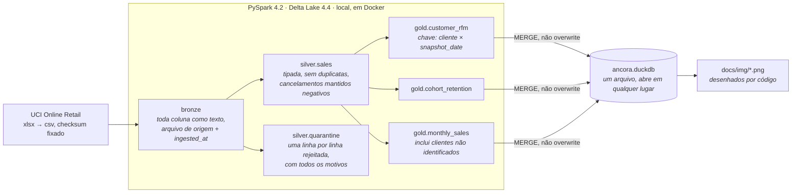

# Âncora

### A mesma entrada produz sempre os mesmos segmentos.

Segmentação RFM e análise de coorte do dataset *Online Retail* da UCI,
reconstruída como um _lakehouse_ bronze / silver / gold: PySpark e Delta Lake
nas transformações, DuckDB no _serving_, uma única imagem Docker para tudo.

<p>
  <a href="https://github.com/kabianca/cohort-rfm-ecommerce/actions/workflows/tests.yml">
    
  </a>
  
  
  
  
  
</p>

[English](README.md) · **Português**

## Por que eu reconstruí isso

Este repositório começou como o terceiro projeto de uma certificação em
análise de dados: um notebook Jupyter, um CSV do Kaggle, um painel no Google
Data Studio. Esse notebook continua aqui, intocado, em [`legacy/`](legacy/),
porque a distância entre ele e o código ao redor é o ponto do repositório.

O notebook calcula recência como quase todo notebook de RFM calcula:

```python
hoje = datetime.now()
rfm['Recencia'] = (hoje - rfm['UltimaCompra']).dt.days
```

O dataset termina em 9 de dezembro de 2011. Rode essa linha hoje e todo
cliente tem recência de mais de cinco mil dias; rode amanhã e todos os números
mudam de novo. Se os segmentos mudam junto depende de como os cortes são
feitos, e ninguém descobre, porque ninguém roda um notebook duas vezes.

Então a tese aqui é o oposto de "olhe os segmentos": é que **duas execuções
sobre a mesma entrada produzem os mesmos segmentos, em qualquer dia, em
qualquer máquina**, e que toda decisão capaz de quebrar isso está escrita e
testada. A recência é ancorada a um `snapshot_date` explícito. Empates num
corte por quintil são resolvidos por uma regra, não pela ordem das linhas.
Somas são decimais, não _doubles_. Linhas que o modelo não consegue usar vão
para a quarentena com um motivo, nunca são descartadas.

O repositório companheiro, [Maré](https://github.com/kabianca/bcb-airflow-pipeline),
defende *correto sob _replay_* para ingestão com Airflow. Este defende
*determinístico sob reexecução* para transformação, e deliberadamente não tem
orquestrador: um portfólio é avaliado pela cobertura, não pela repetição.

---

## Arquitetura



Bronze é substituída por arquivo de origem, silver é reconstruída a partir da
bronze, gold é mesclada com `MERGE`. Uma segunda execução não muda nada, e o
histórico do Delta confirma.

---

## Decisões de design

Esta é a seção que eu leria primeiro se estivesse revisando o repositório.

### A recência é medida a partir de `snapshot_date`, nunca do relógio

`customer_rfm` recebe um parâmetro. O padrão é a última data de fatura nos
dados (`2011-12-09`), e ele pode ser qualquer dia: só faturas até essa data
entram, então `--snapshot-date 2011-06-30` produz a segmentação como ela teria
sido em 30 de junho de 2011, não uma reponderação da de hoje. _Snapshots_
diferentes convivem na tabela, com chave `(customer_id, snapshot_date)`.

Não existe chamada a `now()`, `today()` ou `current_date()` nas
transformações. O único valor de relógio no projeto é o `_ingested_at` da
bronze, que é linhagem, e nada abaixo o lê. Um teste desloca o _snapshot_ em
sete dias e verifica que toda recência se move exatamente sete e nada mais
muda.

### Empates recebem o mesmo score, seja qual for a ordem das linhas

Os scores são quintis de `percent_rank()`, que atribui a valores iguais o
mesmo _rank_. Num dataset de atacado os empates são enormes: **1.493 dos 4.320
clientes compraram exatamente uma vez**. `pd.qcut` nessa coluna se recusa a
rodar (as arestas de 20 % e 40 % são ambas 1), e o contorno habitual,
`rank(method="first")` — ou `ntile()` no Spark — divide o empate pela ordem em
que as linhas por acaso estavam, de modo que alguns compradores de uma vez só
viram score 2 por causa da posição da sua linha num arquivo. Aqui todos são
score 1, e clientes com quatro, cinco ou seis faturas compartilham o score 4.

O custo é real e merece nome: os quintis não têm 20 % cada. Frequência fica em
35 / 19 / 12 / 19 / 16 %. Prefiro isso a uma segmentação de clientes reais que
depende da ordenação.

Os segmentos são então uma lista ordenada de regras sobre o score de recência
e a média de frequência e valor; a primeira regra que casa vence, a última pega
todo o resto. Um teste passa as 125 combinações de score pela lista e confere
que cada uma recebe exatamente um segmento.

### Ausência e cancelamento não são erros

O dataset tem três coisas que um `dropna()` trata como uma só:

- **135.080 linhas (25 %) não têm `CustomerID`.** Não podem ser segmentadas,
  mas são vendas. Ficam fora do RFM e **dentro da receita mensal**, onde são
  15,4 % do ano, £ 1,5 mi de £ 9,8 mi. O `dropna()` do notebook as removia de
  todos os meses.
- **8.668 linhas de cancelamento** (`InvoiceNo` começando com `C`, quantidade
  negativa), no total −£ 475.901. O notebook as removia; aqui ficam na silver
  com o sinal, e a camada gold as compensa: um cancelamento reduz o valor
  monetário do cliente certo e aparece como receita negativa no mês em que
  aconteceu, em vez de sumir.
- **10.670 linhas que o modelo não consegue usar** vão para
  `silver.quarantine`, cada uma com a lista de motivos pelos quais falhou —
  1.363 falham em duas regras ao mesmo tempo. Dado ruim é tratado como dado,
  com rastro:

  | Motivo | Linhas |
  |---|---:|
  | `duplicate` — cópia byte a byte de outra linha | 5.268 |
  | `non_product_stock_code` — postagem, `Manual`, `AMAZONFEE`, descontos, tarifas bancárias | 2.912 |
  | `zero_unit_price` | 2.515 |
  | `negative_quantity_outside_cancellation` — ajustes de estoque, todos sem cliente | 1.336 |
  | `negative_unit_price` — duas linhas de "Adjust bad debt" | 2 |

  Excluir os códigos de serviço move a receita anual em menos de meio por
  cento líquido, mas as partes brutas são grandes e se compensariam em silêncio
  dentro de "receita": postagem é £ 272 mil, tarifas da Amazon são −£ 222 mil.
  As duas são recuperáveis na tabela de quarentena.

Quem conta como cliente segue do mesmo princípio. Um cliente pertence à camada
gold quando seu gasto líquido é positivo. Quem comprou £ 49,50 em janeiro e
devolveu tudo em fevereiro não virou cliente e não funda a coorte de janeiro;
quem tem como única linha o estorno de uma compra anterior ao início dos dados
também não. Isso exclui 42 clientes identificados (líquido de −£ 4.160), cujos
valores continuam contando em `monthly_sales`, porque receita é receita venha
de quem vier.

### Bronze lê texto

Toda coluna chega como _string_, mais o nome do arquivo de origem. Deixar o
Spark inferir tipos já é uma decisão de modelagem (`"ten"` vira nulo, 30 de
fevereiro vira nulo) tomada em silêncio; aqui a silver a toma com `try_cast` e
`try_to_timestamp`, e uma linha que não se deixa tipar ganha um motivo de
quarentena. O arquivo real não tem nenhuma linha assim. A _fixture_ tem duas,
de propósito.

Reingerir o mesmo arquivo substitui as linhas dele (`replaceWhere` pelo nome do
arquivo), então a bronze nunca guarda duas cópias de uma origem.

### Decimal, não double

`unit_price` é `DECIMAL(10,3)`, `line_amount` é `DECIMAL(14,3)`. Uma soma de
_doubles_ depende da ordem em que as partições chegam, que é exatamente o tipo
de coisa que faz duas execuções divergirem no último dígito e uma comparação
de _fingerprint_ falhar sem motivo que alguém consiga defender. O fuso da
sessão é fixado em UTC pela mesma razão: o CSV carrega _timestamps_ sem fuso, e
uma fatura de 23h55 não pode mudar de dia entre o notebook que construiu as
tabelas e o CI que as lê.

### Gold é mesclada, não reconstruída

Cada tabela gold é atualizada com um `MERGE` do Delta: linhas encontradas são
atualizadas, novas são inseridas, e linhas que a origem deixou de produzir são
apagadas — em `customer_rfm`, só dentro do _snapshot_ que está sendo escrito,
então os outros ficam intactos. Uma reexecução converge para exatamente o que
a origem diz em vez de acumular sobras, e o histórico da tabela mostra isso: a
segunda execução do dataset completo é um `MERGE` com 4.320 linhas atualizadas,
0 inseridas, 0 apagadas.

### Uma imagem, três versões fixadas juntas

Spark, Delta e Java quebram quando se afastam, e cada um vive num lugar
diferente (um _pin_ do pip, um artefato Maven, um pacote apt). Aqui o
`pyproject.toml` fixa `pyspark==4.2.0` e `delta-spark==4.4.0`, o `Dockerfile`
fixa Java 21, e um comentário ao lado de cada um diz o que foi verificado e
quando: o Delta 4.4.0 é construído e testado contra o Spark 4.2.0 e exige Java
17 ou mais novo. Os _jars_ do Delta e a extensão `delta` do DuckDB são baixados
na construção da imagem, então `make test` e `make run` não precisam de rede, e
o primeiro teste da suíte escreve uma tabela Delta, faz `MERGE` nela e a lê de
volta pelo DuckDB — o teste que falha primeiro se uma das três versões for
mudada sozinha.

### DuckDB serve, Spark transforma

As tabelas gold são materializadas num único `data/serving/ancora.duckdb`. Ele
abre em qualquer cliente SQL em qualquer máquina sem Spark, Java ou o _lake_, e
é dele que as figuras são desenhadas. Spark num notebook é a ferramenta certa
para as transformações e a errada para olhar 4.320 linhas.

---

## Rodando

Requer Docker; a imagem tem cerca de 2,3 GB com Spark e uma JVM dentro.

```bash
make build    # Spark + Delta + DuckDB, jars pré-baixados
make data     # baixa o arquivo da UCI (23 MB), verifica o checksum, converte para CSV
make run      # bronze → silver → gold → DuckDB, cerca de um minuto num laptop
make charts   # redesenha docs/img/*.png a partir do banco de serving
make test     # 39 testes contra a fixture commitada, sem dataset nem rede
```

`make run SNAPSHOT=2011-06-30` segmenta os clientes como estavam naquele dia.

### Provando em dez segundos

Rode duas vezes e compare um _hash_ da tabela `customer_rfm` inteira. Essa é a
tese do repositório, e a única afirmação que você pode falsificar sozinha.

```bash
$ make run && make fingerprint
4320 customers  e6f4fb920bda77382092e14b1215316f
$ make run && make fingerprint
4320 customers  e6f4fb920bda77382092e14b1215316f
```

### Olhando os resultados

```bash
make shell
python -c "import duckdb; con = duckdb.connect('data/serving/ancora.duckdb'); \
  print(con.sql('select segment, count(*) customers, sum(monetary) revenue from customer_rfm group by 1 order by 3 desc'))"
```

```text
┌─────────────┬───────────┬───────────────┐
│   segment   │ customers │    revenue    │
│   varchar   │   int64   │ decimal(38,3) │
├─────────────┼───────────┼───────────────┤
│ champions   │      1090 │   5674120.250 │
│ loyal       │       778 │   1177445.631 │
│ at_risk     │       652 │    915155.871 │
│ hibernating │      1094 │    300480.961 │
│ promising   │       706 │    202434.610 │
└─────────────┴───────────┴───────────────┘
```

Um quarto dos clientes traz 69 % da receita. O outro quarto, os hibernando,
traz 4 %.

---

## Figuras

Desenhadas por `make charts` a partir do banco de _serving_, então mudam quando
os dados mudam e não de outro jeito.


A coorte de dezembro de 2010 é a maior e a mais fiel — 37 % voltaram no mês
seguinte, e 50 % compraram em novembro de 2011. É também a única coorte que
inclui clientes que já compravam antes do início dos dados, que é o motivo
honesto de ela parecer tão boa.


---

## Estrutura

```text
cohort-rfm-ecommerce/
├── ancora/
│   ├── session.py               # uma SparkSession: Delta, UTC, loopback, jars pré-baixados
│   ├── config.py                # o layout do lakehouse como valor, para os testes o realocarem
│   ├── download.py              # make data: zip da UCI → xlsx → csv, checksum fixado
│   ├── bronze.py                # texto entra, texto sai, mais linhagem; replaceWhere por arquivo
│   ├── silver.py                # tipagem, deduplicação, dez regras de quarentena
│   ├── rfm.py                   # quintis que respeitam empates; a lista de regras de segmento
│   ├── gold.py                  # customer_rfm(snapshot_date), cohort_retention, monthly_sales; MERGE
│   ├── serving.py               # arquivo DuckDB, fingerprint, as três figuras
│   └── __main__.py              # python -m ancora run | charts | fingerprint
├── tests/
│   ├── fixtures/                # 41 linhas e um README explicando o papel de cada cliente
│   ├── test_bronze.py · test_silver.py · test_gold_rfm.py · test_gold_cohort.py
│   ├── test_gold_monthly_sales.py · test_rfm_rules.py · test_serving.py · test_stack.py
├── legacy/                      # o notebook original, como foi entregue
├── docs/img/                    # figuras, geradas
├── Dockerfile · docker-compose.yaml · Makefile · pyproject.toml
└── .github/workflows/tests.yml  # constrói a imagem, roda lint e a suíte dentro dela
```

---

## Testes

Cada linha do desenho acima é um teste, e a suíte roda contra uma _fixture_ de
41 linhas que carrega cada armadilha do arquivo real — um cancelamento, um
cliente nulo, uma duplicata exata, um preço zero e um negativo, códigos de
serviço, três clientes empatados em frequência, uma compra às 23h55 de 31 de
janeiro. [`tests/fixtures/README.md`](tests/fixtures/README.md) diz para que
serve cada linha.

```text
test_gold_rfm.py            recência ancorada ao snapshot; empates compartilham score; um cancelamento
                            reduz o cliente certo; uma duplicata não infla frequência; receita por
                            segmento reconcilia; o MERGE converge e preserva os outros snapshots
test_gold_cohort.py         31 jan → 1 fev é o mês 1; um cliente que cancelou tudo não funda coorte
test_gold_monthly_sales.py  clientes não identificados contam; um cancelamento é negativo, não perdido
test_silver.py              cada linha da bronze cai em exatamente uma tabela, com todos os motivos
test_bronze.py              nada coagido; reingerir um arquivo não o duplica
test_rfm_rules.py           125 combinações de score, um segmento cada; scores independentes de ordem
test_serving.py             contagens no DuckDB, refresh repetível, fingerprint estável, figuras geradas
test_stack.py               escrita Delta, MERGE e leitura pelo DuckDB, com as versões fixadas
```

A suíte roda dentro da imagem (`make test`), porque o Spark precisa de Java e
o sentido da imagem é ninguém ter que instalá-lo. O CI constrói a mesma imagem
a cada _push_ e _pull request_ e roda o lint e a suíte dentro dela; não existe
caminho em que um teste se pule por falta de dependência. A inicialização do
Spark é a maior parte dos 100 segundos.

---

## O que rodar isso me ensinou

- **Spark 4 é ANSI por padrão.** `cast('ten' as int)` lança erro em vez de
  devolver nulo. A silver usa `try_cast` e `try_to_timestamp` de propósito,
  porque nulo é o que as regras de quarentena procuram.
- **Nomes de coluna não distinguem maiúsculas.** `Quantity` (bruta) e
  `quantity` (tipada) não podem ser irmãs num mesmo DataFrame. As colunas
  brutas atravessam a silver dentro de um _struct_ `raw` e são desempacotadas na
  tabela de quarentena.
- **Uma `Column` precisa de sessão viva.** Um `F.col(...)` no nível do módulo
  falha na importação; os predicados são construídos sob demanda.
- **Uma janela particionada por constante é uma partição só** — e o Spark
  avisa a cada execução. Os scores de RFM ranqueiam todos os clientes de um
  _snapshot_, então esse é o desenho, e o aviso é silenciado com um comentário
  dizendo por quê.
- **O Delta 4.1+ nomeia o artefato Maven pela versão menor do Spark**
  (`delta-spark_4.2_2.13`), e o `configure_spark_with_delta_pip` escolhe o
  sufixo pelo pyspark instalado. Os metadados do pip permitem Spark 4.0–4.2; as
  notas de lançamento dizem contra quais deles cada versão do Delta foi
  construída e testada. Confie na segunda.
- **Um contêiner sem rede não resolve o próprio _hostname_**, e a primeira
  coisa que o Spark faz é procurá-lo. Amarrar o _driver_ ao _loopback_ resolveu
  em uma linha tanto o `--network none` quanto o caso do laptop com DNS
  esquisito.
- **O `openpyxl` devolve `InvoiceNo` como int em 532.618 linhas e como str em
  9.291.** A conversão para CSV transforma tudo na sua forma textual e deixa a
  silver decidir o que é.
- **Dezembro de 2011 tem nove dias.** A última barra do gráfico de receita e a
  última célula de cada linha de coorte parecem um colapso até você saber
  disso.

---

## Para onde isso cresce

O repositório está completo como está. Estas são as costuras, na ordem em que
eu as construiria:

| Próximo | O que acrescenta | Onde encaixa |
|---|---|---|
| **Uma série de _snapshots_** | Rodar _snapshots_ mensais e derivar uma matriz de migração de segmentos: quem passou de `loyal` para `at_risk` entre junho e julho | `customer_rfm` já tem o _snapshot_ na chave; um laço sobre `--snapshot-date` e uma tabela gold |
| **Silver incremental** | A silver é reconstruída a partir da bronze a cada execução; um `MERGE` com chave `(arquivo de origem, linha)` a tornaria incremental também | `silver.build` |
| **Orquestração** | Agendamento e _backfill_ | Maré já mostra o padrão; uma DAG chamando `pipeline.run` por _snapshot_ |
| **País na camada gold** | O notebook separava o Reino Unido do resto; o dado está lá | Uma dimensão `country` em `cohort_retention` e `monthly_sales` |
| **Expectativas declarativas** | Great Expectations ou Soda sobre a silver | As regras de quarentena viram expectativas; a fronteira da tabela fica |

## O que eu faria diferente em produção

- **Armazenamento de objetos, não um _bind mount_.** `config.Layout` é um
  valor só; os caminhos apontariam para S3 ou ADLS e nada mais muda.
- **Um catálogo.** As tabelas são endereçadas por caminho. Unity Catalog ou
  Glue dariam a elas nomes, permissões e linhagem.
- **_Snapshot_ como parâmetro agendado, não _flag_ de linha de comando.** O
  intervalo de dados do orquestrador vira o `snapshot_date`, que é a mesma
  ideia do "todo limite vem do intervalo, nunca de `now()`" de Maré.
- **Alerta sobre a quarentena.** O tamanho dela hoje só é um sinal se alguém
  olhar. Um limiar por motivo a tornaria um incidente.

---

## Dados

Fonte: [Online Retail](https://archive.ics.uci.edu/dataset/352/online+retail)
(Chen, 2015), UCI Machine Learning Repository, CC BY 4.0. 541.909 itens de
fatura de um atacadista do Reino Unido, de 1º de dezembro de 2010 a 9 de
dezembro de 2011. `make data` baixa o arquivo e verifica o SHA-256 do
compactado; o dataset em si nunca é commitado.

O notebook em [`legacy/`](legacy/) rodou sobre outro arquivo: a versão
didática do curso para os mesmos dados, agregada a uma linha por fatura, com
datas deslocadas para 2020–2021 e nomes de coluna em português. Os números dele
não são comparáveis com os daqui, e ele é mantido como foi entregue.

---

<p align="center">
  Feito por <b>Karla Oliveira</b> · <a href="https://github.com/kabianca">@kabianca</a>
  <br>
  <sub>Licenciado sob GPL-3.0, por preferência e não por padrão. Perguntas e críticas são bem-vindas; abra uma issue.</sub>
</p>
